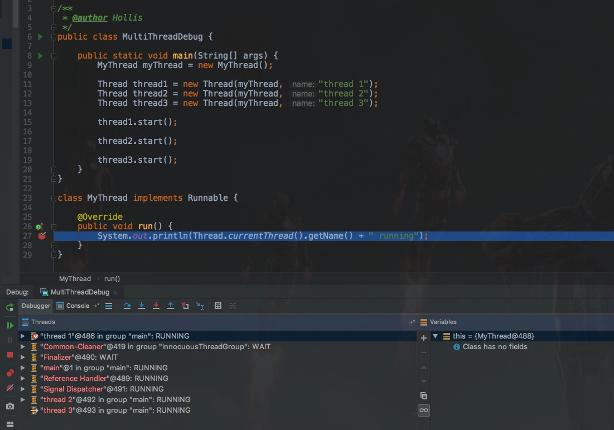
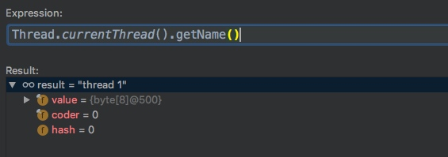
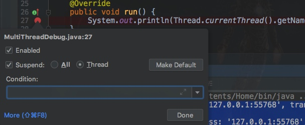

# ✅如何对多线程进行Debug?


# 典型回答


在IDEA中有一个设置，那就是当我们在断点处单击鼠标右键就会弹出一个设置对话框，当我们把其中的All 修改为 Thread之后，尝试重新执行debug代码，每一个线程都会进入到断点当中了。就实现了对多线程进行debug

# 扩展知识
## 多线程Debug示例


首先我们写一个多线程的例子，使用继承Runnable接口的方式定义多个线程，并启动执行。


```plain
/**
 * @author Hollis
 */
public class MultiThreadDebug {

    public static void main(String[] args) {
        MyThread myThread = new MyThread();

        Thread thread1 = new Thread(myThread, "thread 1");
        Thread thread2 = new Thread(myThread, "thread 2");
        Thread thread3 = new Thread(myThread, "thread 3");

        thread1.start();

        thread2.start();

        thread3.start();
    }
}

class MyThread implements Runnable {

    @Override
    public void run() {
        System.out.println(Thread.currentThread().getName() + " running");
    }
}

我们尝试在代码中设置断点，并使用debug模式启动。
```





如题，程序启动后，会进入一个线程的断点中，我们尝试看一下当前是哪个线程：





发现是thread 1进入了断点。接着，我们尝试让代码继续执行，代码就直接结束运行，并且控制台打印如下：


```plain
Connected to the target VM, address: '127.0.0.1:55768', transport: 'socket'
thread 3 running
Disconnected from the target VM, address: '127.0.0.1:55768', transport: 'socket'
thread 2 running
thread 1 running

Process finished with exit code 0
```


如果我们多次执行这个代码，就会发现，每一次打印的结果都不一样，三个线程的输出顺序是随机的，并且每一次debug只会进入到一个线程的执行。


每次执行结果随机是因为不一定哪个线程可以先获得CPU时间片。


那么，我们怎么才能让每一个线程的执行都能被debug呢？如何在多线程中进行debug排查问题呢？


其实，在IDEA中有一个设置，那就是当我们在断点处单击鼠标右键就会弹出一个设置对话框，当我们把其中的All 修改为 Thread之后，尝试重新执行debug代码。





重新执行之后，就可以发现，每一个线程都会进入到断点当中了。


> 更新: 2023-07-09 16:38:02  
> 原文: <https://www.yuque.com/hollis666/un6qyk/ceawgz0qykk89yi7>